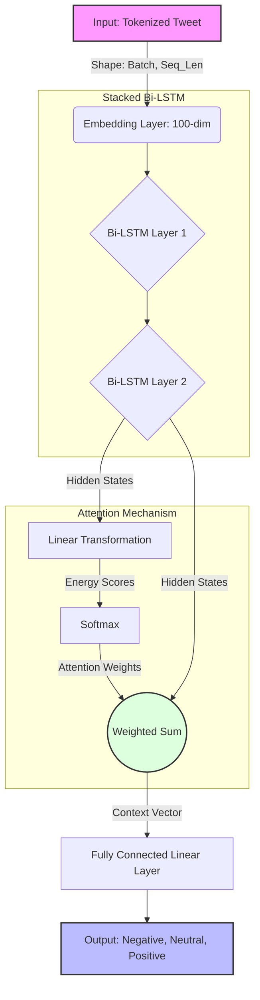

# Airline Sentiment Classification with RNNs

## Project Overview
This project applies deep learning to perform sentiment analysis on a dataset of airline-related tweets. The objective is to accurately classify each tweet into one of three sentiment categories: **Positive**, **Neutral**, or **Negative**. 

The core of this project is a custom-built, object-oriented **PyTorch** pipeline that implements a **Stacked Bidirectional LSTM with an Attention Mechanism**.

## Features
* **Modular Object-Oriented Design**: Clean separation of data processing, model architecture, training loops, and evaluation metrics.
* **Dynamic Padding**: Sequences are dynamically padded to the 95th percentile length of the dataset to optimize memory and computation.
* **Attention Mechanism**: Allows the network to dynamically weight the importance of different words in a tweet, improving context understanding over standard LSTMs.
* **Jupyter Integration**: A clean, analysis-focused Jupyter Notebook that utilizes the underlying Python package without cluttering the workspace with class definitions.

## Project Structure
```text
├── README.md
├──  Datasets/
├   └── preprocessed_tweets.csv      # The cleaned text dataset
├──  Notebooks/
├    └── analysis.ipynb              # The primary notebook for running the pipeline
├──  Output/
└── src/
    ├── __init__.py                  # Exposes classes to the notebook
    └── RNN_sentiment_classification/
        ├── __init__.py
        ├── data/
        │   ├── preprocessor.py      # Vocabulary building and tokenization
        │   └── loader.py            # PyTorch Dataset wrapper
        ├── models/
        │   ├── rnn_model.py         # Stacked Bi-LSTM + Attention architecture
        │   └── trainer.py           # Training loop orchestration
        └── evaluation/
            └── evaluator.py         # Metrics and visualization (matplotlib/seaborn)
```

## Requirements
Ensure you have the following Python libraries installed:
* `torch` (PyTorch)
* `pandas`
* `numpy`
* `scikit-learn`
* `matplotlib`
* `seaborn`
* `jupyter`

You can install the required packages using pip:
```bash
pip install torch pandas numpy scikit-learn matplotlib seaborn jupyter
```

## Usage
1. Clone this repository or download the project folder.
2. Ensure `preprocessed_tweets.csv` is located in the Datasets directory.
3. Launch Jupyter Notebook:
   ```bash
   jupyter notebook
   ```
4. Open `analysis.ipynb` and run the cells sequentially.

## Model Architecture

*(architecture diagram)*



The model (`StackedBiLSTMAttention`) consists of four primary components:
1. **Embedding Layer**: A trainable layer that maps integer tokens to 100-dimensional dense vectors.
2. **Stacked Bi-LSTM**: A 2-layer Bidirectional Long Short-Term Memory network. It processes the sequence in both directions, capturing deep hierarchical features and contextual dependencies from both past and future words.
3. **Attention Layer**: A sequence of linear transformations and a Softmax function that calculates an "energy score" for each time step. It outputs a single context vector that is a weighted sum of the LSTM outputs, allowing the model to focus heavily on sentiment-bearing words.
4. **Classifier**: A final fully connected linear layer mapping the context vector to the 3 target classes.

## Evaluation
The model's performance is evaluated using:
* **Learning Curves**: Tracking Cross-Entropy Loss over epochs for both training and validation sets to monitor convergence and detect overfitting.
* **Confusion Matrix**: A detailed heatmap showing the true vs. predicted classifications to identify which specific sentiments the model struggles to differentiate (e.g., confusing Neutral with Negative).

## 📜 License
#### Distributed under the MIT license.

---

## 👤 Author
***Konstantinos Seferlis***

AI Research & Development

[](https://www.linkedin.com/in/konstantinos-seferlis-b16bb7155/)